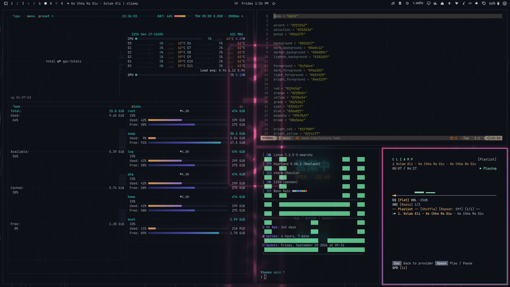

# Neon Rain



Wet asphalt, neon reflections and a late-night ramen shop with lo-fi playing somewhere. A deep navy base lit by neon pink, violet and teal.

## Install

```bash
omarchy theme install https://github.com/sumdahl/omarchy-neon-rain-theme
```

## Palette

| Role | Color |
|---|---|
| background | `#0d1017` |
| foreground | `#cfd6e4` |
| accent | `#ff5fa2` |
| red | `#ff4f6d` |
| orange | `#ff8a5c` |
| yellow | `#ffb454` |
| green | `#6fe3a1` |
| cyan | `#3fd1c7` |
| blue | `#5aa8ff` |
| magenta | `#9b7bff` |
| brown | `#8a5a4a` |

## Wallpapers

- `00-ramen-sign.jpg`: original, made for this theme.
- `01-puddle-reflections.jpg`: PattayaPatrol, *Neon-lit city street at night reflected in a rain puddle*, CC BY-SA 4.0.
- `02-vending.jpg`: Andrea Belvedere, *Vending*, CC BY 2.0.
- `03-golden-gai.jpg`: original, made for this theme.
- `04-typhoon-night.jpg`: John Seb Barber, *Typhoon Koppu time*, CC BY 2.0.
- `05-vending-machines-tokyo.jpg`: LHOON, *Vending machines at night in Tokyo*, CC BY-SA 2.0.
- `06-receipt.jpg`: original, made for this theme.
- `07-wet-street.jpg`: PattayaPatrol, *A wet city street at night, shopfronts and illuminated signs reflecting in puddles*, CC BY-SA 4.0.

Photos are shown as taken, via Wikimedia Commons.

## License

The theme files are MIT licensed. Each wallpaper keeps the license listed above.
